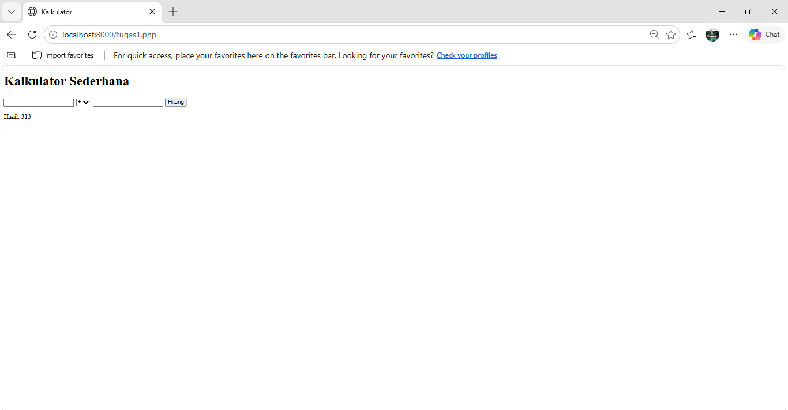
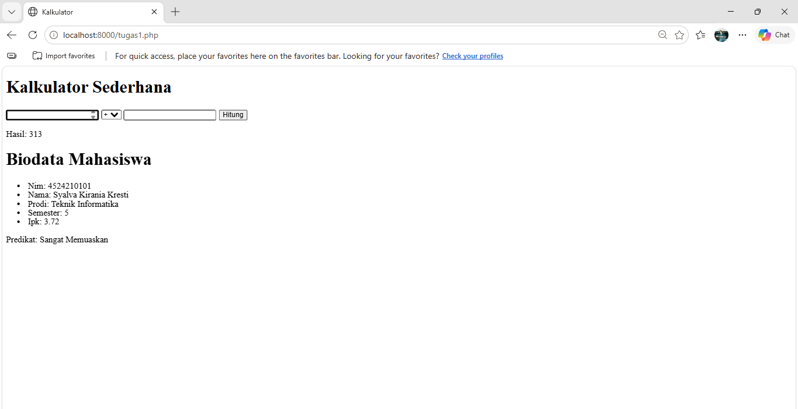
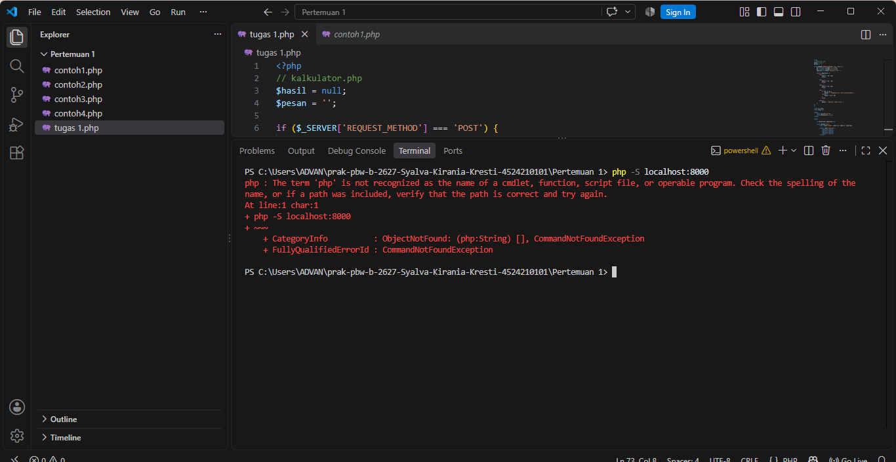

# Tugas 1 Praktikum PBW

## 1. Menjalankan Contoh Pertemuan 1

Pada Tugas 1, seluruh contoh pada Pertemuan 1 dijalankan hingga menghasilkan output tanpa error kritis.

Contoh yang dijalankan:
- Kalkulator
- Biodata Mahasiswa

## 2. Modifikasi Program

### Modifikasi 1 - Menambahkan Email

Modifikasi pertama yang dilakukan adalah menambahkan field `email` pada data mahasiswa.

Data mahasiswa yang sebelumnya terdiri dari NIM, nama, prodi, semester, dan IPK ditambahkan dengan data email.

### Modifikasi 2 - Validasi IPK

Modifikasi kedua yang dilakukan adalah menambahkan validasi IPK.

Validasi digunakan untuk memastikan nilai IPK berada pada rentang 0 sampai 4. Jika nilai IPK kurang dari 0 atau lebih dari 4, program akan menampilkan pesan bahwa IPK tidak valid.

## 3. Lima Bagian Kode yang Penting

### 1. Method POST

Method POST digunakan untuk mengirim data angka dan operator dari form kalkulator ke program PHP.

### 2. Switch

`switch` digunakan untuk menentukan operasi matematika berdasarkan operator yang dipilih, yaitu penjumlahan, pengurangan, perkalian, dan pembagian.

### 3. Array Mahasiswa

Array `$mahasiswa` digunakan untuk menyimpan data mahasiswa seperti NIM, nama, prodi, semester, IPK, dan email.

### 4. Foreach

`foreach` digunakan untuk menampilkan seluruh data yang terdapat dalam array mahasiswa tanpa harus menuliskan perintah output secara berulang.

### 5. Validasi IPK

Validasi IPK digunakan untuk memastikan nilai IPK berada dalam rentang 0 sampai 4.

## 4. Screenshot

### Sebelum Modifikasi

### Hasil Pertemuan 1

### Sesudah Modifikasi 1

### Sesudah Modifikasi 2

### Error yang Ditemukan

## 5. Error, Penyebab, dan Perbaikan

### Error

Error yang ditemukan adalah perintah `php` tidak dikenali oleh Terminal.

### Penyebab

PHP belum terdaftar pada PATH Windows sehingga Terminal tidak dapat menemukan perintah `php`.

### Perbaikan

PHP dijalankan menggunakan PHP yang tersedia pada XAMPP dengan perintah:

`C:\xampp\php\php.exe -S localhost:8000`

Setelah itu server PHP berhasil dijalankan dan program dapat diakses melalui browser.