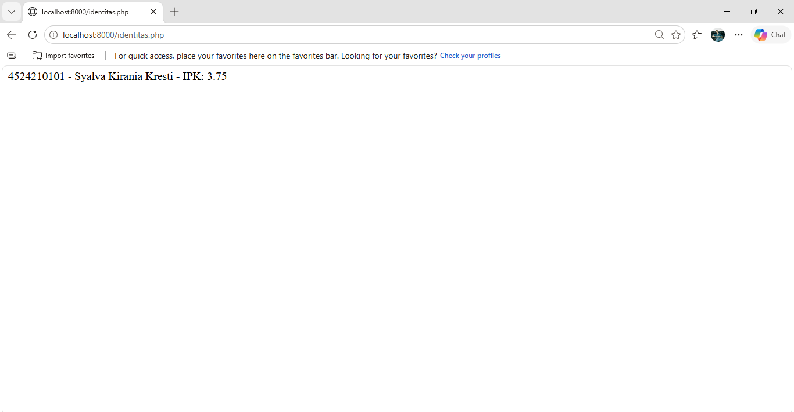
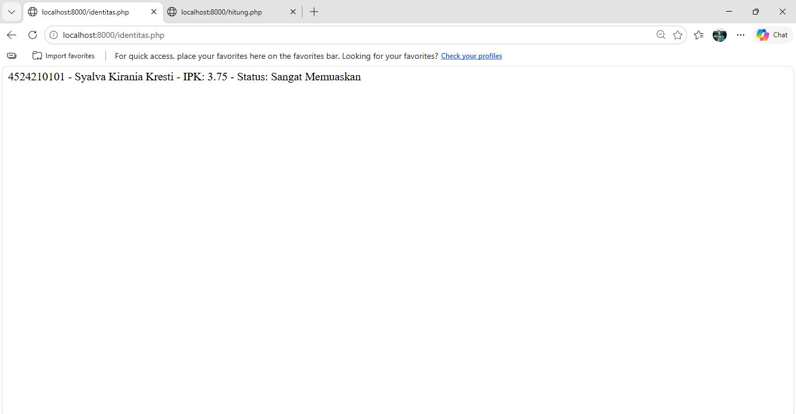
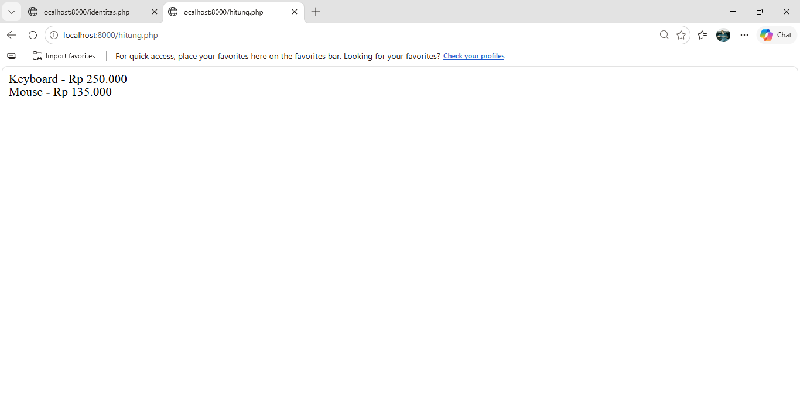
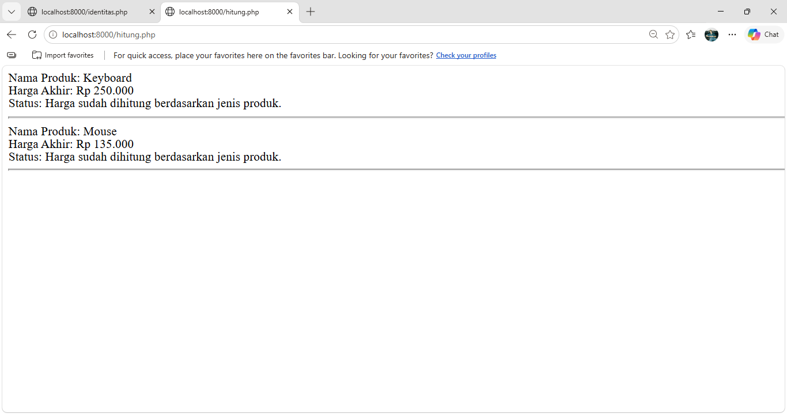

# Tugas 2 Praktikum PBW

## 1. Menjalankan Contoh Pertemuan 2

Pada Tugas 2, contoh pada Pertemuan 2 dijalankan hingga menghasilkan output tanpa error kritis.

Contoh yang dijalankan:
- identitas.php
- hitung.php

## 2. Modifikasi Program

### Modifikasi 1 - Menambahkan Status Mahasiswa

Modifikasi pertama dilakukan pada file `identitas.php`.

Program ditambahkan kondisi untuk menentukan status mahasiswa berdasarkan nilai IPK.

Ketentuan yang digunakan:
- IPK >= 3.50: Sangat Memuaskan
- IPK >= 3.00: Memuaskan
- IPK < 3.00: Perlu Peningkatan

### Modifikasi 2 - Menambahkan Informasi Harga

Modifikasi kedua dilakukan pada file `hitung.php`.

Output program diubah agar menampilkan nama produk, harga akhir, dan informasi bahwa harga telah dihitung berdasarkan jenis produk.

## 3. Lima Bagian Kode yang Penting

### 1. Interface Identitas

Interface `Identitas` digunakan untuk menentukan method `ringkasan()` yang harus dimiliki oleh class yang mengimplementasikannya.

### 2. Class Mahasiswa

Class `Mahasiswa` digunakan untuk menyimpan data mahasiswa berupa NIM, nama, dan IPK.

### 3. Validasi IPK

Validasi IPK digunakan untuk memastikan nilai IPK berada pada rentang 0 sampai 4.

### 4. Class ProdukDiskon

Class `ProdukDiskon` digunakan untuk menghitung harga produk setelah mendapatkan diskon.

### 5. Foreach

`foreach` digunakan untuk melakukan perulangan pada daftar produk dan menampilkan informasi setiap produk.

## 4. Screenshot

### Identitas Sebelum Modifikasi

### Identitas Sesudah Modifikasi

### Hitung Sebelum Modifikasi

### Hitung Sesudah Modifikasi

## 5. Error, Penyebab, dan Perbaikan

### Error

Error yang ditemukan adalah perintah `php` tidak dikenali oleh Terminal.

### Penyebab

PHP belum terdaftar pada PATH Windows sehingga Terminal tidak dapat menemukan perintah `php`.

### Perbaikan

PHP dijalankan menggunakan PHP yang tersedia pada XAMPP dengan perintah:

`C:\xampp\php\php.exe -S localhost:8000`

Setelah itu server PHP berhasil dijalankan dan program dapat diakses melalui browser.