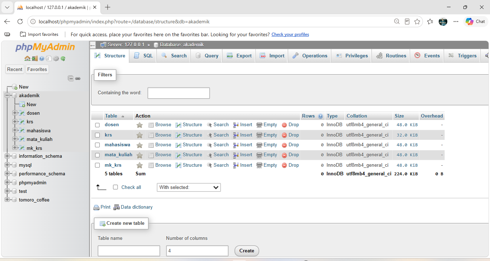
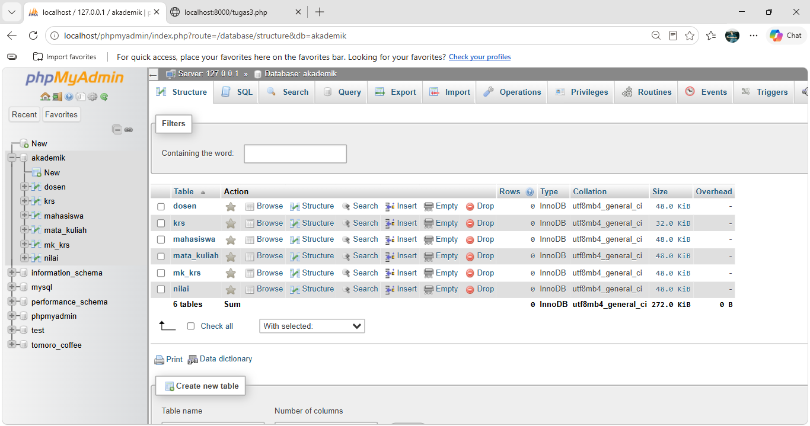
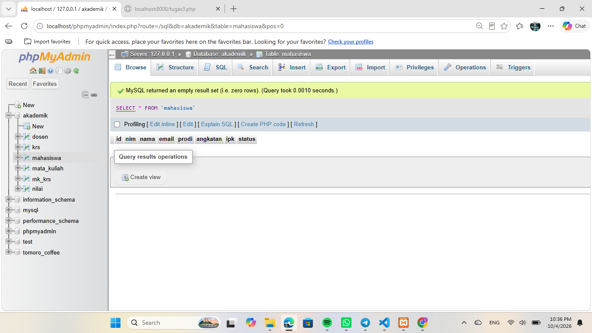

# Tugas 3 - Pertemuan 3

## 1. Menjalankan Contoh 2

Pada Tugas 3, program yang digunakan adalah **Contoh 2** pada materi Pertemuan 3.

Contoh 2 digunakan untuk membuat database `akademik` beserta beberapa tabel, yaitu:

* `mahasiswa`
* `dosen`
* `mata_kuliah`
* `krs`
* `mk_krs`

Program dijalankan menggunakan PHP dan MySQL. Setelah program berhasil dijalankan, database `akademik` dapat dilihat melalui phpMyAdmin.

Perintah untuk menjalankan PHP:

```powershell
C:\xampp\php\php.exe -S localhost:8000
```

Kemudian program dapat dibuka melalui browser:

```text
http://localhost:8000/contoh2.php
```

---

## 2. Modifikasi Program

Pada Tugas 3 dilakukan **dua modifikasi yang bermakna** pada program Contoh 2.

### Modifikasi 1 - Menambahkan Field `status`

Modifikasi pertama adalah menambahkan field `status` pada tabel `mahasiswa`.

Field tersebut memiliki tipe data `VARCHAR(20)` dan nilai default `'Aktif'`.

Kode yang digunakan:

```php
ALTER TABLE mahasiswa
ADD COLUMN status VARCHAR(20) NOT NULL DEFAULT 'Aktif'
AFTER ipk
```

Dengan penambahan ini, tabel `mahasiswa` memiliki informasi tambahan mengenai status mahasiswa.

### Modifikasi 2 - Menambahkan Tabel `nilai`

Modifikasi kedua adalah membuat tabel baru bernama `nilai`.

Tabel `nilai` memiliki beberapa field:

* `id`
* `mahasiswa_id`
* `mata_kuliah_id`
* `nilai_angka`
* `nilai_huruf`

Tabel `nilai` juga memiliki relasi dengan tabel `mahasiswa` dan `mata_kuliah` menggunakan **foreign key**.

Dengan modifikasi ini, database dapat menyimpan nilai mahasiswa untuk mata kuliah tertentu.

---

## 3. Penjelasan 5 Bagian Kode Penting

### 1. `require_once 'koneksi.php'`

```php
require_once 'koneksi.php';
```

Kode ini digunakan untuk memanggil file `koneksi.php` yang berisi konfigurasi koneksi PHP dengan database MySQL.

### 2. Membuat Database

```php
$sqlCreateDB = "CREATE DATABASE IF NOT EXISTS akademik";
```

Kode tersebut digunakan untuk membuat database bernama `akademik`. Perintah `IF NOT EXISTS` membuat database hanya dibuat apabila database tersebut belum tersedia.

### 3. Menjalankan Query Tabel

```php
foreach ($sqlCreateTables as $query) {
    if (mysqli_query($koneksi, $query)) {
        echo "Tabel berhasil dibuat atau sudah ada.<br>";
    }
}
```

Bagian ini digunakan untuk menjalankan seluruh query pembuatan tabel yang disimpan dalam array `$sqlCreateTables`.

### 4. Menambahkan Field `status`

```php
ALTER TABLE mahasiswa
ADD COLUMN status VARCHAR(20) NOT NULL DEFAULT 'Aktif'
AFTER ipk
```

Kode ini merupakan modifikasi pertama. Digunakan untuk menambahkan field `status` pada tabel `mahasiswa`.

Sebelum menambahkan field, program mengecek terlebih dahulu apakah field `status` sudah tersedia agar tidak terjadi kesalahan ketika program dijalankan kembali.

### 5. Membuat Tabel `nilai`

```php
CREATE TABLE IF NOT EXISTS nilai (
    id BIGINT UNSIGNED AUTO_INCREMENT PRIMARY KEY,
    mahasiswa_id BIGINT UNSIGNED NOT NULL,
    mata_kuliah_id BIGINT UNSIGNED NOT NULL,
    nilai_angka DECIMAL(5,2) NOT NULL,
    nilai_huruf VARCHAR(2) NOT NULL
)
```

Kode ini merupakan modifikasi kedua. Digunakan untuk membuat tabel `nilai` yang menyimpan nilai mahasiswa dan memiliki hubungan dengan tabel `mahasiswa` serta `mata_kuliah`.

---

## 4. Screenshot Sebelum dan Sesudah Modifikasi

### Sebelum Modifikasi

Screenshot database `akademik` sebelum dilakukan modifikasi.



### Sesudah Modifikasi

Screenshot database `akademik` setelah dilakukan modifikasi dan penambahan tabel `nilai`.



### Field Status pada Tabel Mahasiswa

Screenshot setelah penambahan field `status` pada tabel `mahasiswa`.



---

## 5. Error, Penyebab, dan Solusi

### Error

Saat menjalankan PHP melalui PowerShell, muncul error:

```text
php : The term 'php' is not recognized as the name of a cmdlet,
function, script file, or operable program.
```

### Penyebab

Error terjadi karena perintah `php` belum dikenali oleh PowerShell. PHP dari XAMPP belum terdaftar pada PATH sistem.

### Solusi

Program PHP dijalankan menggunakan lokasi langsung PHP yang terdapat di XAMPP:

```powershell
C:\xampp\php\php.exe -S localhost:8000
```

Setelah menggunakan perintah tersebut, PHP berhasil dijalankan dan program dapat diakses melalui browser.

---

## 6. Kesimpulan

Pada Tugas 3, program Contoh 2 berhasil dijalankan untuk membuat database `akademik` beserta tabel-tabel yang diperlukan.

Dua modifikasi yang dilakukan adalah menambahkan field `status` pada tabel `mahasiswa` dan membuat tabel baru `nilai` yang memiliki relasi dengan tabel `mahasiswa` dan `mata_kuliah`.

Dengan adanya modifikasi tersebut, struktur database menjadi lebih lengkap dan dapat menyimpan informasi tambahan mengenai status mahasiswa serta nilai mahasiswa.
