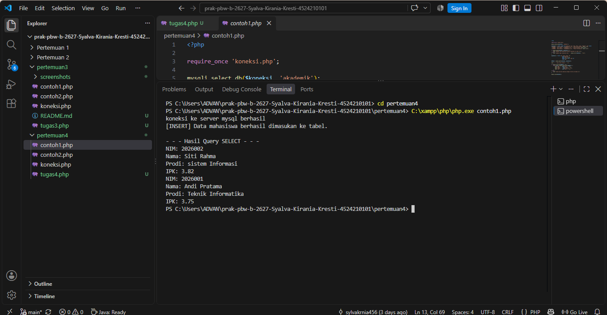
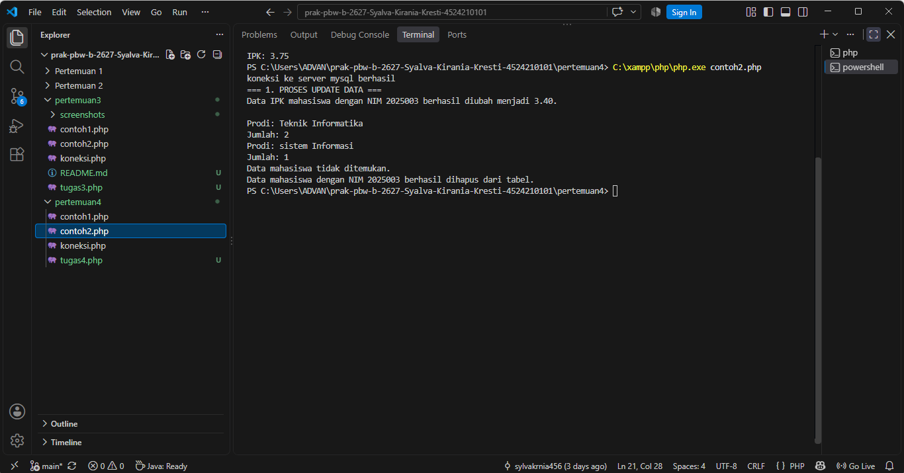
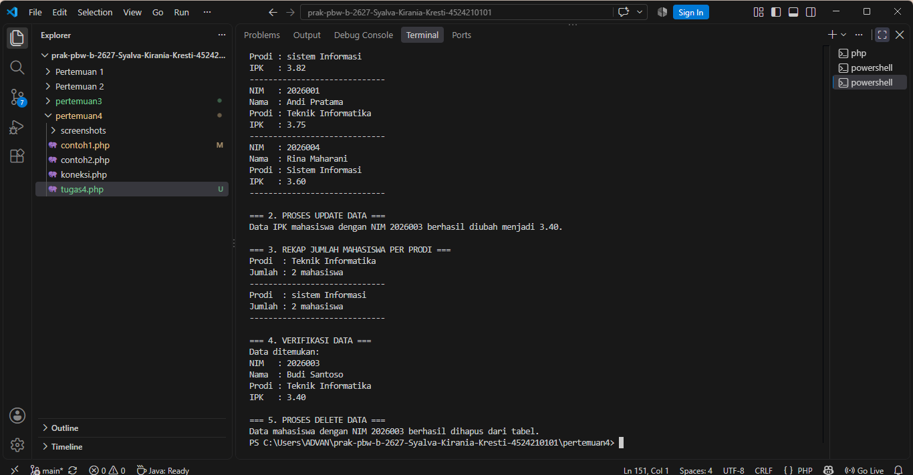
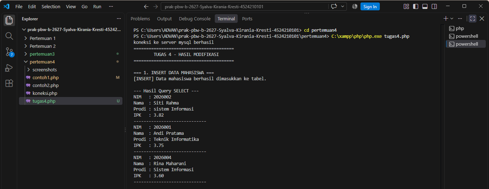

# Tugas 4 - Pemrograman Berbasis Web

## 1. Deskripsi

Tugas 4 merupakan praktik pengolahan database menggunakan PHP dan MySQL. Pada tugas ini, Contoh 1 dan Contoh 2 dijalankan terlebih dahulu sebelum dilakukan modifikasi.

Database yang digunakan adalah `akademik` dengan tabel `mahasiswa`.

---

## 2. Struktur Folder

```text
Pertemuan 4/
├── koneksi.php
├── contoh1.php
├── contoh2.php
├── tugas4.php
├── README.md
└── screenshots/
    ├── sebelum_contoh1.png
    ├── sebelum_contoh2.png
    ├── sesudah_dimodifikasi.png
    └── sesudah_modifikasi.png
```

---

## 3. Contoh 1 Sebelum Modifikasi

Contoh 1 melakukan proses `INSERT` data mahasiswa dan `SELECT` data mahasiswa berdasarkan IPK minimal 3.50.

### Hasil Running Contoh 1



---

## 4. Contoh 2 Sebelum Modifikasi

Contoh 2 melakukan beberapa operasi database, yaitu:

* `UPDATE` data IPK mahasiswa.
* `SELECT` dan `GROUP BY` untuk rekap jumlah mahasiswa berdasarkan program studi.
* `SELECT` untuk verifikasi data.
* `DELETE` data mahasiswa.

### Hasil Running Contoh 2



---

## 5. Modifikasi yang Dilakukan

Pada Tugas 4, dilakukan modifikasi pada **Contoh 1 dan Contoh 2**.

### Modifikasi Contoh 1

Menambahkan satu data mahasiswa baru pada proses `INSERT`, yaitu:

* NIM: `2026004`
* Nama: `Rina Maharani`
* Email: `rina@kampus.ac.id`
* Prodi: `Sistem Informasi`
* Angkatan: `2026`
* IPK: `3.60`

Penambahan data ini membuat program dapat mengolah data mahasiswa tambahan.

### Modifikasi Contoh 2

Menambahkan kondisi:

```sql
HAVING COUNT(*) >= 2
```

pada proses rekap jumlah mahasiswa berdasarkan program studi.

Query yang digunakan:

```sql
SELECT prodi, COUNT(*) AS jumlah_mahasiswa
FROM mahasiswa
GROUP BY prodi
HAVING COUNT(*) >= 2
ORDER BY jumlah_mahasiswa DESC;
```

Kondisi tersebut digunakan agar hanya program studi yang memiliki minimal dua mahasiswa yang ditampilkan.

---

## 6. Hasil Setelah Modifikasi

Setelah dilakukan modifikasi pada Contoh 1 dan Contoh 2, program dijalankan melalui file `tugas4.php`.

### Hasil Modifikasi





---

## 7. Penjelasan 5 Bagian Kode Penting

### 1. Koneksi Database

```php
require_once 'koneksi.php';
mysqli_select_db($koneksi, 'akademik');
```

Digunakan untuk menghubungkan PHP dengan database `akademik`.

### 2. INSERT

```php
$sqlInsert = "INSERT IGNORE INTO mahasiswa ...";
```

Digunakan untuk memasukkan data mahasiswa ke dalam tabel `mahasiswa`.

### 3. SELECT

```sql
SELECT nim, nama, prodi, ipk
FROM mahasiswa
WHERE ipk >= 3.50;
```

Digunakan untuk menampilkan mahasiswa yang memiliki IPK minimal 3.50.

### 4. GROUP BY dan HAVING

```sql
GROUP BY prodi
HAVING COUNT(*) >= 2
```

`GROUP BY` digunakan untuk mengelompokkan mahasiswa berdasarkan program studi. `HAVING` digunakan untuk memberikan kondisi terhadap hasil pengelompokan.

### 5. UPDATE dan DELETE

```sql
UPDATE mahasiswa
SET ipk = 3.40
WHERE nim = '2026003';
```

Digunakan untuk mengubah IPK mahasiswa.

```sql
DELETE FROM mahasiswa
WHERE nim = '2026003';
```

Digunakan untuk menghapus data mahasiswa berdasarkan NIM.

---

## 8. Error, Penyebab, dan Solusi

### Error

Pada Contoh 2, data mahasiswa dengan NIM `2025003` tidak ditemukan.

### Penyebab

Contoh 1 menggunakan data dengan NIM `2026001`, `2026002`, dan `2026003`, sedangkan Contoh 2 menggunakan NIM `2025003`. Data dengan NIM tersebut tidak tersedia pada tabel `mahasiswa`.

### Solusi

Pada `tugas4.php`, NIM yang digunakan untuk proses `UPDATE`, verifikasi, dan `DELETE` disesuaikan menjadi `2026003`, sehingga proses dapat dilakukan terhadap data yang tersedia.

---

## 9. Kesimpulan

Tugas 4 berhasil menerapkan operasi pengolahan database menggunakan PHP dan MySQL.

Contoh 1 dan Contoh 2 berhasil dijalankan sebelum modifikasi. Selanjutnya dilakukan modifikasi pada kedua contoh, yaitu menambahkan data mahasiswa baru pada proses `INSERT` dan menambahkan kondisi `HAVING COUNT(*) >= 2` pada proses rekap mahasiswa berdasarkan program studi.

Melalui tugas ini, dapat dipahami penggunaan operasi `INSERT`, `SELECT`, `UPDATE`, `GROUP BY`, `HAVING`, dan `DELETE` dalam pengolahan database menggunakan PHP dan MySQL.
